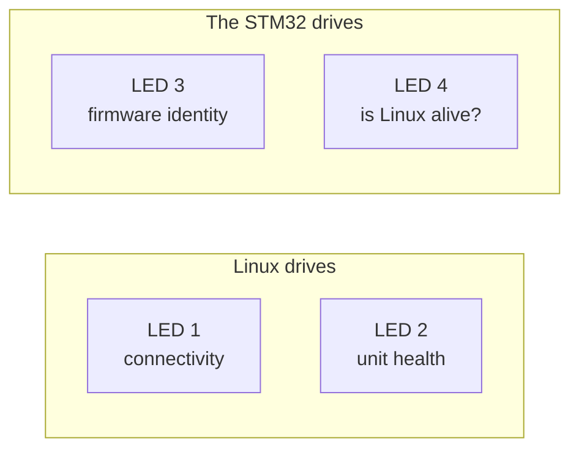

<!--
Copyright (c) 2026 Jim Wyatt
SPDX-License-Identifier: MIT
-->
# Four lights that tell the truth

There are four RGB LEDs on this board, above the matrix and opposite the USB-C
port. Out of the factory they do almost nothing useful. This chapter is about
turning them into instruments — and it is really a chapter about **designing an
indicator**, which is a harder problem than it sounds and one you will meet
again on anything that has to report on itself.

The rule everything below follows:

> [!IMPORTANT]
> An indicator earns its place only if a **change in it** carries information
> you did not already have. Anything else is decoration that costs you attention
> every time you glance at the board.

## Counting them is the first surprise

Ask Linux what LEDs it has:

```bash
ls /sys/class/leds/
```

```
mmc0::            unoq:bt-blue2     unoq:panic-red2
unoq:user-blue1   unoq:user-green1  unoq:user-red1
unoq:wlan-green2
```

Seven entries. This project's first attempt read that as seven indicators, lit
them independently, and produced a board showing two solid blue lights and no
information whatsoever.

They are not seven LEDs. They are **two RGB packages** — three colour channels
each — plus one kernel entry (`mmc0::`) for a light that is not on this board at
all. `user-red1`, `user-green1` and `user-blue1` are the red, green and blue
elements of a single physical LED. Drive all three and you get white, which is
why the board looked wrong.

That leaves two more physical LEDs, and they are not Linux's. They belong to the
STM32, which sees them as `led3_red`/`led3_green`/`led3_blue` and `led4_*`.



## Choosing what each one says

Four indicators, and far more than four things you could show. The interesting
part is what got rejected.

### LED 1 — can this board reach anything?

| | |
|---|---|
| **green** | the internet is reachable |
| **blue** | a computer is on the USB cable, but nothing beyond it |
| **red** | no uplink at all |

Blue is the one that earns its keep. "Cable plugged in but the host is not
sharing its connection" and "nothing there at all" are completely different
problems with completely different fixes, and without a third colour they look
identical.

### LED 2 — does anything need a human?

| | |
|---|---|
| **green** | every systemd unit is healthy, and the bind guard has not tripped |
| **red** | something has failed that will **not** recover on its own |

Note how narrow that is. Almost everything on this board retries: the USB link
comes back, the gadget rebinds, wifi falls back. Those are not worth a light.
Red means the self-healing has been exhausted.

### Green is not decoration

A dark LED cannot distinguish "nothing is wrong" from "the thing that checks
whether anything is wrong is not running". Those need very different responses,
so healthy is a *colour*, not an absence. The service that drives these has
`Restart=always` and an `ExecStopPost` that turns them off — so if the checker
dies, the board goes dark rather than staying confidently green.

## The two that got thrown away

The first design for LEDs 3 and 4 was the obvious one: blink on MPU↔MCU traffic,
and light up on eMMC activity. Both were wrong, and the board made it obvious
within a minute of looking at it.

**"Blink on every message" made LED 3 into a clock.** The CPU-bars demo sends a
frame every 0.5 seconds, so the light blinked every 0.5 seconds, forever. An
indicator whose period is set by somebody else's timer tells you the timer is
running. The matrix beside it already said that, in more detail.

**eMMC activity could not be shown at a useful resolution.** Linux samples the
disk counters twice a second and would have to push the answer down a 115200
serial line. A real activity light flickers on individual transfers; what this
produced was a lamp that sat on for the duration of a copy and off otherwise —
which the CPU bars already implied.

There is a second, sharper reason it failed. The kernel offers `mmc0`,
`disk-activity` and `disk-write` triggers on this board, and **none of them
fire**: measured at 0 of 400 samples under sustained writes. An indicator wired
to a trigger that never fires is worse than no indicator, because a dark light
reads as "idle".

## What replaced them

Both were re-pointed at things **only the microcontroller knows**, and that
change slowly enough that every transition means something.

### LED 3 — the firmware's own identity

| | |
|---|---|
| **green** | running a **confirmed** image — this is what survives a reset |
| **yellow** | running an **unconfirmed** image, on MCUboot probation |
| **red** | a subsystem failed to start |

Yellow is the good one. After a firmware update, MCUboot runs the new image on
trial; if nothing confirms it, the next reset reverts to the old one. That state
is completely invisible unless you go and read the slot table — and it is
precisely what you want to see on the hardware after an update, because it is
the difference between "the update took" and "the update is about to undo
itself". See [Updating safely](updating-safely.md).

### LED 4 — is the other chip still there?

| | |
|---|---|
| **green** | heard from Linux within the last four seconds |
| **red** | silence for longer than that |

This is the inverse of the blink it replaced, and the inversion is the whole
point. A tick tells you nothing. **The tick stopping is the news** — and it is
news Linux structurally cannot deliver, because a host that has stopped talking
cannot report that it has stopped talking.

It is the only indicator on the board that says something about the *other*
chip's health, and it is on the correct chip to say it.

## A bug this design produced, and what it taught

The first version read the confirmed flag once, in `main()`, and cached it. So
after confirming an image by hand, LED 3 stayed yellow — reporting a state that
had been true at boot and was no longer true.

The fix is a one-second work item that re-reads `boot_is_img_confirmed()` while
the image is unconfirmed. The lesson generalises: **an indicator that samples
once is a memory, not an instrument.** Everything here re-samples — Linux every
five seconds, reachability every sixty, the MCU every one — so the colours
correct themselves instead of remembering something that stopped being true.

## Try it

What the colours mean, from the board itself:

```bash
~/hybrid/status/leds.sh explain
```

Learn them by watching them cycle:

```bash
sudo ~/hybrid/status/leds.sh test
```

Now make LED 2 tell the truth about a real failure. Break something on purpose:

```bash
sudo systemctl start does-not-exist.service    # fails immediately
sudo systemctl --failed
```

Within five seconds LED 2 should go red. Clear it:

```bash
sudo systemctl reset-failed
```

And prove LED 4 is watching Linux rather than blinking on a timer — stop
talking to the MCU for five seconds and watch it go red, then come back.

> [!TIP]
> **Go deeper** — [hardware.md](../reference/hardware.md) has the full
> LED table and which package each sysfs entry belongs to. The kernel's
> [LED class documentation](https://docs.kernel.org/leds/leds-class.html)
> explains what a *trigger* is and what those three inert ones were supposed to
> do. `status/leds.sh` and `mcu/app/src/status_leds.c` are both commented with the
> reasoning above.

## Check yourself

1. Seven entries in `/sys/class/leds/`, four physical LEDs. Explain.
2. Why is "healthy" a colour here rather than an unlit LED?
3. LED 4 is driven by the MCU and reports on Linux. Why can that not be done the
   other way round?
4. You want to add a fifth indicator for "the SD card is nearly full". Argue
   both sides using the rule at the top of this page.

Next: when none of the lights help, and you have to find out what a program with
no screen is actually doing.
