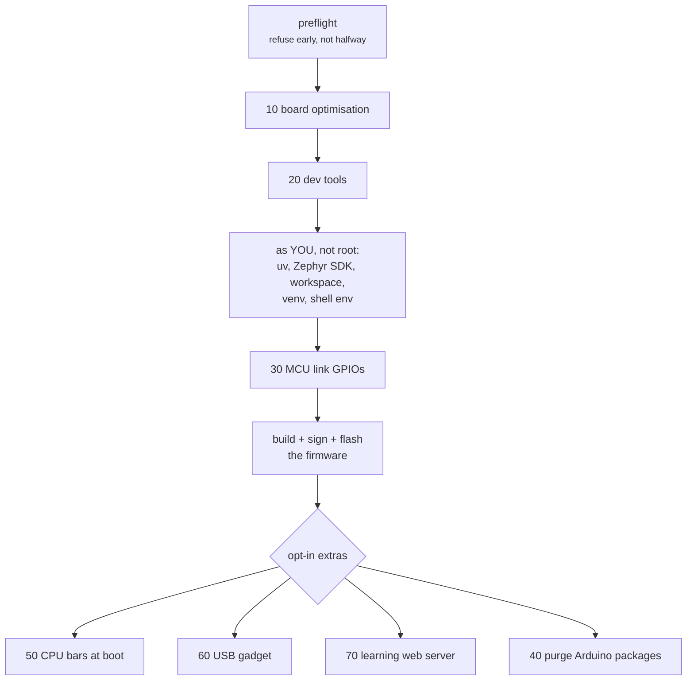

<!--
Copyright (c) 2026 Jim Wyatt
SPDX-License-Identifier: MIT
-->
# From factory to this

Every chapter so far has assumed a board that already works. This one is about
how it got that way, and it is the part of the project most worth copying,
because it is not really about this board at all.

The claim the whole repository stands on:

> [!IMPORTANT]
> A factory-reset UNO Q becomes the board described in this course by running
> **one command**, and running it a second time is safe.

That is a much stronger claim than "here are the steps", and everything about
how the scripts are written follows from trying to make it true.

## Why not just write down the steps

Because instructions rot, and because you will need them at the worst possible
moment.

A list of commands in a README is untested by construction. It drifts from what
the board actually needs, one forgotten line at a time, and you only find out
when you are standing in front of a bricked board at midnight. A script that
runs is at least *executable* documentation — and if it is also run regularly,
it is documentation that cannot be wrong for long.

The stronger version is what this project aims at: the setup **is** the
specification. There is no separate description of how the board should be
configured, because the scripts are it.

## Idempotence, and why it is the whole design

The single most important property here:

**Running `bootstrap.sh` twice does the same thing as running it once.**

That is not a tidiness point. It changes what the script *is*:

- It becomes the recovery path. A run that died forty minutes in, halfway
  through a 3.3 GB download, is fixed by running it again — not by working out
  what got done and resuming by hand.
- It becomes safe to run on a board that is already working, which means people
  actually run it, which means it stays true.
- It becomes testable. You can run it on a board, then run it again and check
  that it reports "already done" for everything.

Achieving it is unglamorous. Every operation has to check first:

```bash
if systemctl is-enabled --quiet unoq-leds.service 2>/dev/null; then
  skip "status LEDs already enabled"
else
  systemctl enable --now unoq-leds.service
  did "status LEDs enabled and started"
fi
```

That shape is everywhere, which is why the shared primitives in
[`provision/lib.sh`](https://github.com/jim-wyatt/two-computers-one-board/blob/main/provision/lib.sh)
exist — `write_file`, `install_unit`, `disable_unit`, `apt_install`,
`ensure_group` — each of which is the idempotent version of something the shell
does not offer idempotently.

The output vocabulary matters too. Every script says one of four things about
every action:

| | |
|---|---|
| `did` | I changed something |
| `skip` | already correct, I did nothing |
| `warn` | something is not right, but I can continue |
| `fail` | I cannot continue, and here is what to do |

A second run of a healthy board is a wall of `skip`. That is the signal you are
looking for, and it is only meaningful because the script genuinely checked.

## The shape of the run



Numbered, because order matters and a reader should be able to see it. Split at
`provision/user/`, because **half of it must not be root**: the Zephyr
workspace, the Python venv and the shell environment all belong to you, and a
`sudo` in the wrong place leaves a 3.3 GB directory you cannot write to. That is
a real failure mode, and the split is how it is prevented rather than warned
about.

## Everything expensive is opt-in

```bash
./bootstrap.sh                     # the board, working
./bootstrap.sh --with-cpu-bars     # LED matrix at boot   (holds /dev/ttyHS1)
./bootstrap.sh --with-usb-gadget   # IP over USB          (drops the USB host port)
./bootstrap.sh --with-learning     # web server on :8080
./bootstrap.sh --with-purge        # remove the Arduino packages
./bootstrap.sh --everything
```

Each flag costs you something concrete, and the comment beside it says what.
Running the demo at boot claims the serial port, so the MCU shell stops working
until you stop the service. The USB gadget turns the only USB port into a
device, so nothing plugged into it works any more.

This is a general principle worth taking away: **a setup script should not
quietly take something away from you.** If an option has a cost, the cost
belongs next to the option, in the interface, not three pages into a document.

## Every change says how to undo it

Near the top of each provisioning script:

```bash
# REVERT: systemctl disable --now unoq-usb-gadget.service &&
#         rm /etc/systemd/system/unoq-usb-gadget.service \
#            /etc/udev/rules.d/99-unoq-usb-gadget.rules &&
#         systemctl daemon-reload && udevadm control --reload
```

Writing that line is a discipline more than a feature. If you cannot state how
to undo a change in a couple of commands, the change is probably too broad, and
noticing that at the time it is written is much cheaper than noticing it later.

## The one file the scripts refuse to overwrite

`/etc/default/unoq-usb` is written once and then left alone, and the script says
why:

> It is the one file on this board a person is expected to edit, and a
> provisioning run that reset the mode every time would undo the change on the
> next bootstrap — most likely while the board is running on the very link the
> setting controls.

That is the limit of "the script is the specification". Configuration a human
owns has to survive the tool, or the tool becomes something people stop running.

## What actually happened when this was tested

The claim at the top of this page was tested the honest way: by factory-resetting
a board and running the scripts on it. It did not work.

[The findings log](../reference/clean-board-findings.md) is the unedited record —
seventeen separate things wrong, each with the symptom, the cause and the fix
that went back into the scripts. A sample of the flavour:

- A `systemd` unit left behind in a failed state, so a board that was working
  reported as unhealthy forever.
- A preflight check that passed on a developed board and failed on a clean one,
  because it tested for something an earlier run had created.
- A tier of optimisations enabled by default that nothing in this project needs.

None of these are interesting individually. Collectively they are the point:
**"it works on my board" is not a claim about the board, it is a claim about
your board's history.** The only way to find out what you have accidentally
depended on is to start from nothing.

> [!NOTE]
> This is why [Knowing it works](knowing-it-works.md) is honest about CI running
> on a different architecture than the board. The same failure mode, one level
> up.

## Try it: read a script instead of running one

You almost certainly do not want to re-provision a working board right now. Read
one instead — they are written to be read:

```bash
less ~/two-computers-one-board/provision/60-usb-gadget.sh
```

Look for four things: the `REVERT:` line at the top, the `step` headings, an
`if` that checks before changing, and a comment explaining a decision rather
than restating the code.

Then see what a second run looks like on something small and safe:

```bash
sudo bash ~/two-computers-one-board/provision/30-mcu-link.sh
```

It should be almost entirely `skip`. That wall of "already correct" is
idempotence, working.

> [!TIP]
> **Go deeper** — [the findings log](../reference/clean-board-findings.md) is
> the full list. [ShellCheck](https://www.shellcheck.net/) is what keeps these
> scripts honest, and
> [systemd for Administrators](https://0pointer.de/blog/projects/systemd-for-admins-1.html)
> explains the unit behaviour several of the findings turned on.

## Check yourself

1. What does idempotence buy you that a correct one-shot script does not?
2. Why is half of `bootstrap.sh` deliberately not run as root?
3. `/etc/default/unoq-usb` is written once and never again. Give the failure that
   rule prevents.
4. A colleague says their setup script "works, I ran it yesterday". What single
   question tells you whether that means anything?

Next: what to build with all of this.
