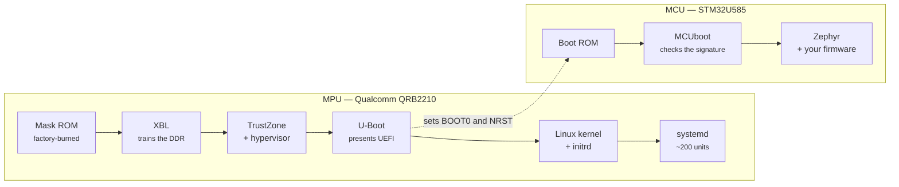

<!--
Copyright (c) 2026 Jim Wyatt
SPDX-License-Identifier: MIT
-->
# From power to prompt

You plug the board in. About two and a half minutes later it is ready. For the
first ten seconds of that, **nothing you have ever written is running** — not
your program, not Linux, not even most of the firmware. Something else is in
charge, and it is handing control on in stages.

This chapter is about those stages, on both chips. It matters for a practical
reason: when a board does not come up, the useful question is not "why is my
program broken" but "how far did it get?"

## The chain, and why there is one

A processor coming out of reset can do almost nothing. Its memory controller is
not configured, so the gigabytes of RAM on the board are unusable. Its clocks
are at some slow default. It has no idea what an eMMC is, let alone a
filesystem.

So it runs a small program from a place that needs no setup — ROM built into
the chip — whose only job is to load a slightly larger program that can do
slightly more. That one loads the next. Each stage exists because the stage
before it could not yet do what the stage after it needs.



The two chains are the same idea at different scales. The MPU takes six stages
and ten seconds to reach Linux; the MCU takes three and a few milliseconds to
reach your code. Both start in ROM nobody can change, and both hand off to
something signed.

## What each stage is doing

| Stage | Lives in | Its one job |
|---|---|---|
| **Mask ROM (PBL)** | Silicon. Burned at manufacture, unchangeable | Find and verify the next stage |
| **XBL** | `xbl_a` / `xbl_b` | Configure the memory controller so RAM exists at all |
| **TZ / hyp** | `tz_a`, `hyp_a` | Set up the secure world the main OS is *not* allowed into |
| **U-Boot** | `boot_a` / `boot_b` | Present a standard UEFI interface, find a kernel, start it |
| **Linux** | `rootfs` | Drivers, filesystems, processes |
| **systemd** | `rootfs` | Start the ~200 services that make it a usable machine |

The kernel confirms the fourth line itself, in its very first log message:

```
efi: EFI v2.11 by Das U-Boot
```

That single line is doing a lot of work. It says the kernel was not started by
some Qualcomm-specific mechanism; it was started through **UEFI**, the same
firmware interface a laptop uses, provided here by
[Das U-Boot](https://docs.u-boot.org/en/latest/). The board is more standard
underneath than its parts list suggests.

## Everything down there exists twice

List the partitions by name and something jumps out:

```
xbl_a   xbl_b     tz_a   tz_b     hyp_a   hyp_b
abl_a   abl_b     boot_a boot_b   uefi_a  uefi_b
```

Every stage of the boot chain is stored **twice**, in an A slot and a B slot.
An update writes the inactive slot and switches a pointer; if the new one fails
to boot, the pointer goes back.

You have seen this idea before, or you are about to: it is exactly what
[Updating safely](updating-safely.md) describes for the microcontroller, where
MCUboot keeps two copies of your firmware and reverts an update that does not
confirm itself. Same problem — *how do you replace the software that does the
replacing* — and the same answer, at two very different scales.

## The part you cannot see

Try to read the earliest stages and you mostly cannot. `xbl_a` is Qualcomm's,
signed, and not documented publicly. There is no source to read.

This is worth sitting with rather than skipping past. On a commercial
system-on-chip, **the bottom of the stack is closed**, and the open part starts
somewhere in the middle. It is a real constraint on what you can debug, and one
of the honest differences between a board like this and, say, a microcontroller
you can single-step from the first instruction.

What you *can* still do is observe. The partition names, the kernel's EFI line
and the boot timings are all evidence, and this whole chapter was reconstructed
from them.

## U-Boot knows about the microcontroller

Here is a detail this project found by accident, and it is a good demonstration
of reading evidence rather than documentation.

The MCU does not start on its own. Two MPU GPIO lines decide *whether* and *how*
it boots — `BOOT0`, which selects between running your firmware and sitting in
the chip's own ROM bootloader, and a reset line. Set them wrong and the board
looks completely dead, which is why
[hardware.md](../reference/hardware.md) puts them at the top of the page.

Those lines have to be in a sane state before Linux is even running. Something
must set them. It turns out to be U-Boot, whose embedded devicetree names all
five wires between the two chips:

| Name in U-Boot's devicetree | GPIO |
|---|---|
| `mcu-swdio-state` | 25 |
| `mcu-swclk-state` | 26 |
| `mcu-boot0-state` | 37 |
| `mcu-nrst-state` | 38 |
| `mcu-spi-rdy-state` | 70 |

> [!NOTE]
> The last one is interesting and not fully settled. This project calls GPIO 70
> the *UART link enable*, because setting it high is empirically what makes
> `/dev/ttyHS1` produce bytes. U-Boot calls it an **SPI ready** line. Both can
> be true — a pin can be wired to more than one thing — but it does suggest the
> two chips were designed to talk over something faster than a 115200 serial
> line, which nothing in this project currently uses.

## Why this board takes two minutes

Ask it where the time goes:

```
Startup finished in 4.710s (firmware) + 1.736s (loader) + 5.747s (kernel)
                  + 2min 12.917s (userspace) = 2min 25.112s
```

Twelve seconds to reach userspace, then two minutes in it. That looks like a
bug. It is not:

```
2min 132ms  unoq-usb-confirm.service
  16.508s   unoq-usb-gadget.service
```

`unoq-usb-confirm` **deliberately waits**. It is the second half of the bind
guard described in [One cable, many devices](one-cable-many-devices.md): the
USB gadget can, in the wrong conditions, take the board's power supply down with
it. So the board waits a full two minutes, and only then records "that bind
survived". A boot that dies before the two minutes is up never gets counted as
successful, and after three of those the guard stops binding at all.

The cost of that safety is a boot that *reports* as slow. It is a good example
of a number that means the opposite of what it looks like — and a reminder to
read `systemd-analyze blame` as a list of what took time, not a list of faults.

## Try it: watch it come up

Ask systemd for the summary, then for the detail:

```bash
systemd-analyze
systemd-analyze blame | head -15
systemd-analyze critical-chain
```

`blame` sorts by duration. `critical-chain` is more useful and less obvious: it
shows only the units that actually *delayed* the next thing, which is usually a
much shorter list.

Now the first moments, before systemd existed:

```bash
sudo dmesg | head -20
```

Look for `Machine model:`, the `efi:` line, and the memory setup. Everything
before those messages happened in code you cannot read.

The boot chain, as partitions:

```bash
ls /dev/disk/by-partlabel/ | column
```

Count the `_a` / `_b` pairs.

And, if you want to see the finding above with your own eyes:

```bash
sudo dd if=/dev/disk/by-partlabel/boot_a bs=1M count=16 2>/dev/null \
  | strings -n 4 | grep -A2 -E "^mcu-.*-state$"
```

That is reading a devicetree out of a bootloader image with `strings`. It is
crude, and it is exactly how the table above was produced.

> [!TIP]
> **Go deeper** — [hardware.md](../reference/hardware.md) has the GPIO
> numbers, the two UARTs and the flash layout.
> [Bootlin's training materials](https://bootlin.com/docs/) cover the
> general shape of an embedded Linux boot far better than any one board's
> documentation can, and the
> [`systemd.service` manual](https://www.freedesktop.org/software/systemd/man/latest/systemd.service.html)
> explains what `Type=` and `RemainAfterExit=` do to the timings you just read.

## Check yourself

1. Why can the mask ROM not simply load Linux directly?
2. Every bootloader partition on this board exists twice. What problem does that
   solve, and where else on the board is the same trick used?
3. `systemd-analyze blame` says a unit took two minutes. Give a reason that
   would be a bug, and a reason it would be correct.
4. If the MCU is running its ROM bootloader instead of your firmware, which of
   the five GPIO lines above would you look at first?

Next: both chips are awake. Now they have to talk to each other, over a wire
that carries bytes and has no idea what a message is.
