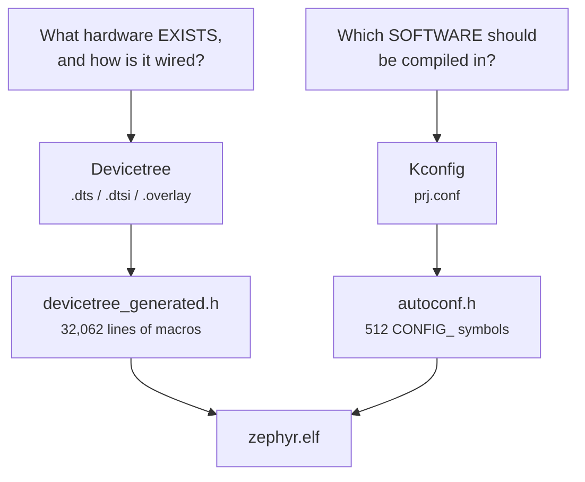

<!--
Copyright (c) 2026 Jim Wyatt
SPDX-License-Identifier: MIT
-->
# How the build knows your hardware

Zephyr supports something like a thousand boards. The source you just compiled
is the same source everyone else compiles. So how did it know that *this* board
has an LED panel wired across port F, that the console should come out of
`lpuart1` and not `usart1`, and that a timer called TIM17 exists at address
`0x40014800`?

Not by detecting any of it. A microcontroller cannot enumerate its own
circuit board. It was **told**, at build time, by two separate systems that
beginners constantly confuse with each other.

## Two questions, two answers



**Devicetree describes hardware.** It is data, not code: a tree of nodes saying
"there is a UART here, at this address, with this interrupt, connected to these
pins". It cannot make anything happen. It is a description of a circuit board
that the build turns into C macros.

**Kconfig selects software.** It is a huge menu of yes/no choices: compile the
I²C driver or do not, include the shell or do not, build with MCUboot support or
do not.

The distinction that makes it click:

> [!IMPORTANT]
> Devicetree says the board **has** an I²C controller. Kconfig says your program
> **uses** one. Both must agree. `CONFIG_I2C=y` on a board whose devicetree has
> no I²C node compiles a driver that drives nothing; an I²C node with
> `CONFIG_I2C=n` describes hardware whose driver was never built.

Every "device not ready" error in Zephyr is, more often than not, those two
disagreeing.

## You do not edit the board file

Zephyr already ships a description of the UNO Q at
`zephyr/boards/arduino/uno_q/arduino_uno_q.dts`. You do not change it — it is
upstream's, it will be updated, and your board is not special enough to fork it.

Instead you write an **overlay**: a small file that is layered on top. This
project's is 38 lines, and it is worth reading in full because it does exactly
three things.

### 1. Pick which device plays which role

```dts
/ {
	chosen {
		zephyr,console = &lpuart1;
		zephyr,shell-uart = &lpuart1;
	};
};
```

`chosen` is the devicetree's way of saying *which one*. The board has several
UARTs; this says the console goes out of `lpuart1`, which is the one physically
wired to the Linux side and appears there as `/dev/ttyHS1`. The Arduino header's
UART is `usart1`, and pointing the console at it is a mistake that produces a
board which looks completely silent while working perfectly.

### 2. Turn a device on

```dts
&gpiof {
	status = "okay";
};
```

Three words, and they matter more than they look. Devices in the SoC
description exist but are **disabled** by default — on this build, 77 of them
are, against 27 enabled. A disabled node is not compiled into the image, gets no
driver instance, and its clock is never switched on.

`status = "okay"` enables port F, which is what makes its clock run. After that
[`matrix.c`](https://github.com/jim-wyatt/two-computers-one-board/blob/main/mcu/app/src/matrix.c)
writes the port's registers directly, because the 104 LEDs need pins that change
direction every 10 microseconds and the ordinary GPIO API is too slow for that.
See [The LED matrix](the-led-matrix.md).

### 3. Configure a device, and add a child

```dts
&timers17 {
	status = "okay";
	st,prescaler = <4>;

	counter_matrix: counter {
		status = "okay";
	};
};
```

`&timers17` reaches into an existing node and overrides part of it. `st,prescaler`
is a **binding-defined property**: the `st,stm32-timers` binding says a timer may
have one, and what it means. The `counter_matrix:` label is a name your C code
can use — `DEVICE_DT_GET(DT_NODELABEL(counter_matrix))` — to get a handle on
exactly this device and no other.

## What Kconfig adds

The overlay declares a counter. That does nothing on its own; the counter
*driver* still has to be compiled, and that is
[`prj.conf`](https://github.com/jim-wyatt/two-computers-one-board/blob/main/mcu/app/prj.conf)'s
job:

```kconfig
CONFIG_COUNTER=y
```

Thirty-eight lines like that produce the 512 symbols in the final configuration.
The gap between 38 and 512 is Kconfig's other half: **dependencies**. Ask for
`CONFIG_SHELL=y` and you get the shell, its backends, its history buffer and a
dozen things it needs, without listing them.

The same mechanism bites in the other direction, and this project has the scar:

```kconfig
# MCUMGR_TRANSPORT_SHELL needs these two or it silently disables itself
CONFIG_BASE64=y
CONFIG_CRC=y
```

A Kconfig option with an unmet `depends on` does not error. It **quietly becomes
`n`**, and you get a build that succeeds and a feature that is not there. If a
feature you enabled appears not to exist, the first thing to check is whether it
actually ended up enabled.

## Seeing what the build decided

Everything above is merged at build time into files you can read. This is the
single most useful debugging trick in Zephyr and almost nobody is shown it.

```bash
zbuild ~/two-computers-one-board/mcu/app          # if it is not already built
cd ~/zephyrproject/build/zephyr
```

**The final devicetree**, all layers merged into one 1,943-line file:

```bash
grep -A3 "chosen {" zephyr.dts
```

```dts
zephyr,code-partition = &slot0_partition;  /* in zephyr/boards/arduino/uno_q/arduino_uno_q.dts:21 */
zephyr,console = &lpuart1;                 /* in ../two-computers-one-board/mcu/app/boards/arduino_uno_q.overlay:11 */
zephyr,shell-uart = &lpuart1;              /* in ../two-computers-one-board/mcu/app/boards/arduino_uno_q.overlay:12 */
```

Look at those comments. Zephyr annotates **every property with the file and line
it came from**. When a setting is not what you expected, this tells you which
layer won, which is a question that is otherwise genuinely hard to answer.

**The final configuration**, all defaults and dependencies resolved:

```bash
grep -c "^CONFIG" .config          # 512, from your 38
grep "^CONFIG_COUNTER" .config
```

**The macros your C code actually sees**:

```bash
wc -l include/generated/zephyr/devicetree_generated.h
```

Thirty-two thousand lines of `#define`, generated from that tree. Every
`DT_NODELABEL(...)` in the firmware resolves to one of them, at compile time, at
no runtime cost. Devicetree is not read on the chip; there is no parser in the
image. It has all been turned into constants before the first instruction runs.

## Try it: break it on purpose

The fastest way to believe the two systems are separate is to make them
disagree.

Comment out one line of `prj.conf`:

```kconfig
# CONFIG_COUNTER=y
```

Rebuild. The overlay still declares `counter_matrix`, the devicetree still has
the node, and the build fails — because `DEVICE_DT_GET` produced a reference to
a device object that was never compiled. Read the error carefully; it is a
*linker* error, not a devicetree one, and knowing that tells you which of the
two files to go and fix.

Put it back and rebuild before moving on.

> [!TIP]
> **Go deeper** — Zephyr's
> [devicetree introduction](https://docs.zephyrproject.org/latest/build/dts/index.html)
> is the right next read, and unusually good; start with "Introduction to
> devicetree" and ignore the bindings reference until you need it. The
> [Kconfig documentation](https://docs.zephyrproject.org/latest/build/kconfig/index.html)
> explains `depends on`, `select` and why `select` is discouraged.
> [mcu.md](../reference/mcu.md) has this project's build commands.

## Check yourself

1. In one sentence each: what does devicetree describe, and what does Kconfig
   decide?
2. You add a sensor node to your overlay and the build compiles, but
   `device_is_ready()` returns false. Name two different single-line causes.
3. Why does `status = "okay"` on a node that already exists change anything?
4. Where would you look to find out which file set a devicetree property, when
   three files could have set it?

Next: 104 LEDs, 11 pins, and a chip that has to lie to your eyes to make it work.
