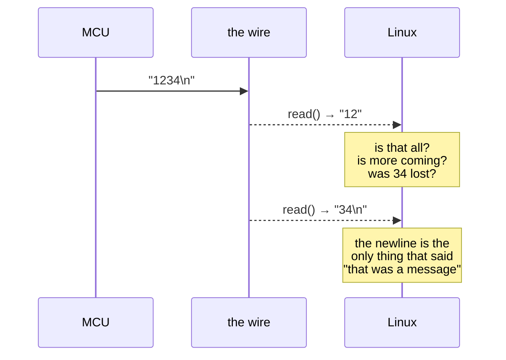

<!--
Copyright (c) 2026 Jim Wyatt
SPDX-License-Identifier: MIT
-->
# How they talk

Two computers, no shared memory. To cooperate they must send bytes down a wire.
This page is about that wire, the two extra wires that make it usable, and why
"just send the data" is harder than it sounds.

## Serial, from the bottom

The connection is a **UART** — a universal asynchronous receiver/transmitter.
Strip the name and it is this: one wire for each direction, and a byte is sent
by wiggling the voltage on it in a pattern both ends have agreed on.

There is no clock wire. That is what "asynchronous" means, and it is the reason
both ends must agree in advance on **how fast** to wiggle. That speed is the
**baud rate**, and ours is 115200 — roughly 115,200 signal changes per second,
about 11 KB/s of actual data.

If the two ends disagree about the baud rate, you do not get an error. You get
garbage: the receiver samples at the wrong moments and reconstructs bytes that
were never sent. A screenful of `ÿ<ÿ?ÿ` almost always means a baud mismatch, not
a broken cable.

On Linux the wire appears as a file:

```bash
ls -l /dev/ttyHS1
```

Reading that file gives you bytes the microcontroller sent. Writing to it sends
bytes back. That really is the whole interface.

## The two wires nobody documents

Here is where this board bites people, and it is the reason
[hardware.md](../reference/hardware.md) exists.

Two GPIO pins on the Linux side control the microcontroller. They are on
`gpiochip1`, and they are documented nowhere official:

| Line | What it does | What you see when it is wrong |
|---|---|---|
| **37** | MCU **BOOT0** | Firmware flashes *and verifies*, but never runs |
| **70** | UART link enable | MCU transmits, `/dev/ttyHS1` reads nothing |

**BOOT0** decides *what the microcontroller runs when it starts*. High, and the
chip boots a small program burned into it at the factory that waits for someone
to send it new firmware. Low, and it runs your program. The pin is only sampled
at reset, so it must be set *before* the chip restarts, not after.

The failure this produces is nasty because everything reports success. Your
firmware writes correctly. Verification passes. The chip is simply running a
different program — the factory bootloader — which does not blink your LEDs.

**The link enable** turns on the path between the two chips. Without it the
microcontroller happily transmits into a disconnected wire, and Linux reads an
eternally empty file. Both sides are working. No error is available anywhere.

`unoq-link.service` sets both at boot:

```bash
systemctl status unoq-link
```

> **This is the single most useful thing on this page.** If the board ever looks
> dead — flashed fine, running nothing; or connected fine, saying nothing —
> suspect these two pins before anything else.

## Bytes are not messages

You have a wire that carries bytes. You want to send a *value*. Those are not
the same thing, and the gap is called **framing**.

Say the microcontroller sends the number 1234. You read the file and get `12`.
Is that the whole message? Is more coming? Has 34 been lost, or is it merely
late? The wire cannot tell you — bytes arrive when they arrive, in any grouping.



Every serial protocol solves this somehow:

- **A terminator**: send text and agree that a newline ends a message. Simple,
  human-readable, and what a shell does.
- **A length prefix**: say how many bytes are coming, then send exactly that
  many.
- **Fixed size**: agree every message is exactly 8 bytes.

This project uses the first. The microcontroller runs a **shell**, the same one
you typed at on the previous page, and the "protocol" is: send a command line,
read text back until the prompt returns.

```c
/* mcu/app/include/app_proto.h - the format both sides agree on */
#define APP_STATUS_FMT "uptime_ms=%lld flip=%d sweeps=%u"
```

The MCU prints that; Python parses it. It is not the fastest possible design,
and that is a deliberate trade: you can debug it by hand with `tio`, which
matters far more here than saving bytes.

## Why the Python side is more complicated than you would expect

Reading a reply sounds like `read()` and done. In practice
[`unoq/mcu.py`](../../python/unoq/mcu.py) copes with all of this:

- **The shell echoes your command back**, so the first thing you read is what you
  just sent, not the answer.
- **Output is wrapped in ANSI escape codes** for colour, which must be stripped.
- **Bytes dribble in.** One `read()` rarely returns a whole reply; you must keep
  reading until you see the prompt.
- **The reply might never come.** If the MCU is reset, or held in the wrong boot
  mode, you wait forever unless you impose a timeout.

That last point is why the project's tests **fake the serial port deliberately
badly** — echoing commands, wrapping output in escape codes, dribbling bytes a
few at a time. A fake that answers instantly and perfectly would let broken code
pass.

## Try it: watch the conversation

Two windows, or two SSH sessions. In the first, watch the raw wire:

```bash
sudo systemctl stop unoq-cpu-bars
mcucon                     # raw bytes from /dev/ttyHS1
```

In the second, make something happen:

```bash
cd ~/two-computers-one-board
./.venv/bin/python -c "
from unoq import MCU
with MCU() as mcu:
    print(mcu.status())
"
```

Watch the first window. You will see the command arrive, the echo, and the
reply — the actual bytes crossing between two computers. Then:

```bash
sudo systemctl start unoq-cpu-bars
```

## The other direction

So far Linux asks and the MCU answers. The demo works the other way: Linux
computes bar heights and pushes them down, hundreds of times a minute, and the
MCU never replies.

That asymmetry is deliberate. Waiting for an acknowledgement to every frame
would cap the frame rate at the round-trip time of the wire. For a display, a
dropped frame is invisible — the next one is 200 ms away — so the cost of losing
one is far lower than the cost of waiting for confirmation.

**Choosing whether a message needs an answer is a real design decision**, and
"always" is usually the wrong one.

> [!TIP]
> **Go deeper** — [Beej's Guide to Network Programming](https://beej.us/guide/bgnet/)
> is nominally about sockets and is the friendliest explanation anywhere of the
> lesson on this page: bytes are not messages. For framing schemes with a proper
> worst case, read
> [Consistent Overhead Byte Stuffing](https://en.wikipedia.org/wiki/Consistent_Overhead_Byte_Stuffing);
> for why a checksum you invented is weaker than you think, Ross Williams'
> [Painless Guide to CRC Error Detection](https://www.zlib.net/crc_v3.txt).
> [SparkFun's serial tutorial](https://learn.sparkfun.com/tutorials/serial-communication)
> covers the electrical layer this page skims over.

## Check yourself

1. `/dev/ttyHS1` reads nothing at all, and the MCU is definitely running. Which
   of the two control pins do you suspect, and why?
2. Your terminal fills with `ÿ?ÿ<`. What is wrong, and is it a hardware fault?
3. Why does the demo not wait for the MCU to confirm each frame? When would that
   be the wrong choice?

Next: turning source code into something the chip can run — and getting it there.
