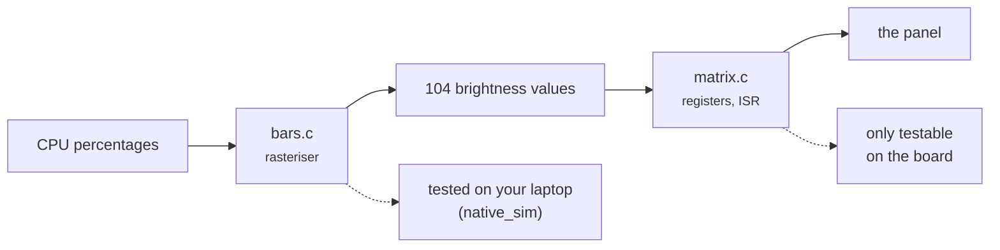
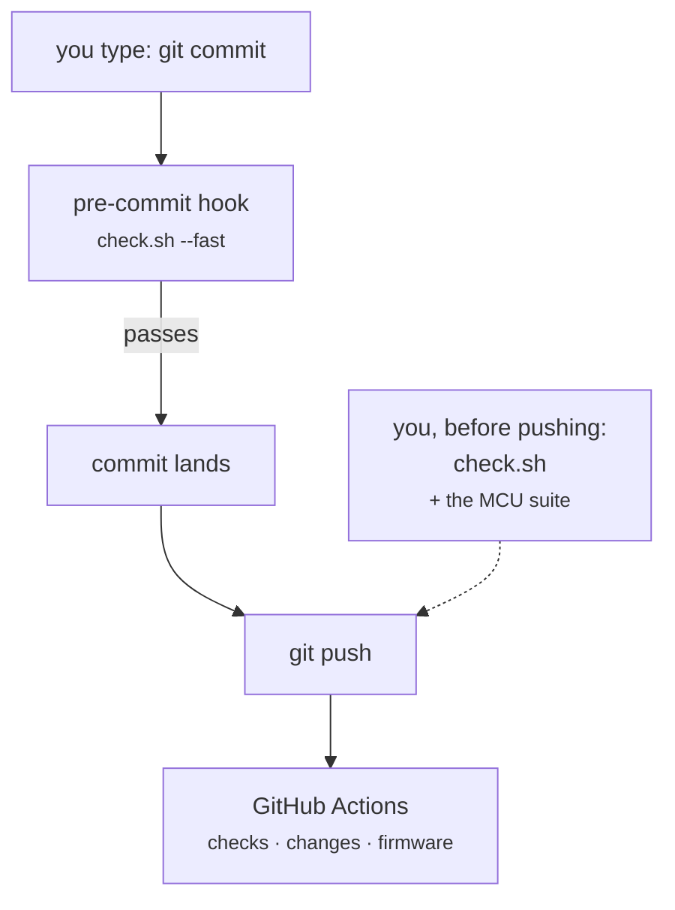

<!--
Copyright (c) 2026 Jim Wyatt
SPDX-License-Identifier: MIT
-->
# Knowing it works

Embedded development has a bad habit: you change something, flash it, look at
the board, and decide from the LEDs whether it worked. That is a test — a slow,
unreliable, unrepeatable one that only you can run, only once, and only with the
hardware in front of you.

This chapter is about the other kind. Not because testing is virtuous, but for a
specific and selfish reason: **a board is a terrible place to find out you were
wrong.** Flashing takes tens of seconds, a bad image can require a physical
recovery, and half the failures produce no output at all. Anything you can find
before the wire is worth finding there.

## The gates

Everything in this project is checked by one command, which is also exactly what
runs in CI:

```bash
tools/check.sh                # everything
tools/check.sh --fast         # skip the MCU suite (~70s of Zephyr build)
tools/check.sh --fix          # reformat in place, then check
tools/check.sh docs           # one area
```

```
--- summary ---
  PASS  ruff lint            Python mistakes
  PASS  ruff format          Python layout
  PASS  mypy (strict)        Python types
  PASS  pytest + coverage    104 tests, 100% of branches
  PASS  shellcheck           shell mistakes
  PASS  shfmt                shell layout
  PASS  bats (shell behaviour)  35 tests, no board involved
  PASS  zephyr version pin   the two places it is written agree
  PASS  clang-format         C layout
  PASS  docs (mkdocs --strict)  every documentation link resolves
```

Three things about that list are deliberate and worth stealing.

**Every gate runs even when an earlier one fails.** One pass shows you all the
work rather than the first thing to break. Stopping at the first failure feels
tidier and wastes your time.

**A missing tool is a failure, not a skip.** An early version of this script
reported "All 2 gates passed" on a machine with no `mypy` and no `pytest`,
having type-checked nothing and run no tests at all. A gate that silently does
nothing is worse than no gate, because it produces confidence.

**Formatting is a gate, not a suggestion.** Not because layout matters, but
because arguing about it in review is expensive and a diff full of whitespace
hides the change that matters.

> [!WARNING]
> Formatters are a real source of "works here, fails in CI". This project has an
> open bug where `clang-format` disagrees with itself between versions on one
> `enum` in `status_leds.c`, so the gate passes on the board and fails on the
> runner. If your formatter is not version-pinned, it is not a gate — it is a
> coin toss with extra steps.

## Testing firmware without firmware

The MCU code is C, running on a Cortex-M33, driving hardware. It also runs on
your laptop.

Zephyr can build for a target called `native_sim`, which compiles the *same
source* — the kernel, your application, the logic — as an ordinary program for
the host machine. Test it there and you get results in seconds instead of a
flash cycle, on any machine, with a debugger that works properly.

```bash
mcu/ztest.sh          # what `tools/check.sh mcu` runs
```

This project tests two things that way:

- **`bars/`** — the rasteriser: given four CPU percentages, which of the 104
  pixels light up, and at what brightness. Pure arithmetic, no hardware, and
  exactly the kind of code that is embarrassing to get wrong.
- **`link_protocol/`** — framing and parsing of the messages coming from Linux.

What it *cannot* test is the part that touches registers: the charlieplexing
driver writes `MODER` and `BSRR` directly, and there is no such register on a
laptop. That is the honest boundary. The rule this project follows is to split
code so the interesting logic sits on the testable side of it, and the untestable
part is as small and as dumb as possible.



That is the design decision, drawn: the boundary between the two boxes exists
*so that* the left one can be tested.

## Testing Linux-side code without a board

The Python suite is 104 tests and touches no hardware at all. There is no serial
port, no GPIO chip and no MCU involved; every one of them runs against a fake.

That sounds like cheating and is not. What is being tested is the code this
project wrote — does it frame the message correctly, does it handle a short
read, does it recover when the port disappears mid-conversation. Testing that
`pyserial` can open a port tests `pyserial`.

The tests that genuinely need a board exist and are marked:

```python
@pytest.mark.hardware
```

They are **deselected by default** (`-m "not hardware"`), so the suite is
runnable on a laptop, in CI, and on a board whose serial port is currently held
by the demo. Opt in with `pytest -m hardware` when the hardware is there.

## Testing shell, which is where the bugs actually were

Here is an uncomfortable measurement of this project:

| | lines | checked by |
|---|---:|---|
| **shell** (40 scripts) | **5,256** | `shellcheck` + `shfmt` |
| Python | 807 | 104 tests, 100% of branches |
| C | 965 | ztest on `native_sim` |

The largest component by a factor of five had **no behavioural tests at all**.
And every one of the twenty-one findings in
[the log](../reference/clean-board-findings.md) was in shell or in a `systemd`
unit — not one was in the Python or the C that all the testing effort went into.

That is a very common shape, and it is worth recognising in your own projects:
**the tested part is usually the part that was easy to test**, not the part most
likely to hurt you.

### The trick that made it possible

The obvious fix is to split every script into a "decide" half and a "do" half,
and test the first. That is a large change to scripts that currently work, made
*before* there are any tests to catch it going wrong — the wrong order.

But these scripts already have a seam, because **everything they actually do is
another program**: `ip`, `nmcli`, `systemctl`, `logger`. Put a directory of fake
versions at the front of `PATH` and the real script runs, unmodified, while
nothing reaches the board. What you assert on is the command line it *would*
have used.

```bash
stub_body ip <<'SH'
case "$1 $2" in "link show") exit 1 ;; esac   # pretend the bridge has gone
exit 0
SH

run usb/usb-route.sh add 02:00:00:00:00:01 192.168.137.1
[ "$status" -eq 0 ]
! ran_like 'ip route'      # it noticed, and did nothing
```

The runner is [bats](https://github.com/bats-core/bats-core), which is itself
shell.

### Write the bug down as a test

Both suites exist because those two scripts had already failed in ways that were
expensive:

- **The bind guard counted wrong.** `udev` triggers the bind unit three times on
  a perfectly healthy plug-in, so counting invocations reached its limit of 3
  during the first *successful* one and refused to bind ever again — a guard
  causing exactly the outage it exists to prevent.
- **The USB route metric was 500**, which beat wifi's 600, so plugging the board
  into a computer silently handed that computer the default route. SSH survived,
  so nothing looked broken, while `apt` and `git` simply stopped.

Neither is the kind of thing you would think to test in advance. Both are
obvious once they have happened, and a test is how you make sure they happen
only once.

> [!TIP]
> A suite that passes the first time you run it may be asserting nothing. Break
> the code on purpose and check the *right* test goes red. Both of these were
> mutation-tested against the two bugs above before being committed — reversing
> the guard's same-boot check turns exactly one test red, and it is the one
> named after the bug.

## The 100% that is not what it looks like

Coverage is enforced at 100%, including branches, and the build fails below it.
That number is easy to misread, so, plainly:

**Coverage measures which lines ran. It says nothing about whether the assertion
was any good.** A test that calls every function and asserts nothing scores
100%.

It is enforced anyway, for one narrow reason: at 100%, *any* drop is a signal.
New code without a test is visible immediately, in the diff, without anyone
having to notice. At 87% the number drifts and nobody can tell the difference
between 87% and 86%. The threshold is not a claim about quality — it is a
ratchet that makes one specific kind of omission impossible to miss.

## Where the gates run



The hook runs the fast gates on every commit; ~70 seconds of Zephyr build is too
slow to sit in front of one. CI runs the same script — that matters, because a
green CI then means the same thing as a clean local run rather than something
adjacent to it.

CI splits it into three jobs, and the shape is worth copying:

| job | time | what it is for |
|---|---|---|
| `checks` | ~30 s | lint, types, tests, coverage, docs |
| `changes` | ~2 s | does this change touch anything the firmware is built from? |
| `firmware` | ~5 min | cross-compile for the Cortex-M33, sign, run the MCU suites |

The expensive one is **gated twice**. It `needs: checks`, so thirty seconds of
linting decides whether five minutes of Zephyr download begins at all; and it is
skipped entirely when `changes` says nothing under `mcu/` moved. Most changes to
this repository are documentation, and none of those can affect a Cortex-M33
binary.

That gating proved itself on its first run: a workflow with a broken action
reference failed `checks` in two seconds, and `firmware` never started.

> [!WARNING]
> A skipped job reports as **skipped**, not **success**. If `firmware` were ever
> made a required check for merging, a documentation-only change would sit
> unmergeable forever. Require the job that always runs.

> [!NOTE]
> Until recently the second job did not exist, and **a change that broke the
> firmware build got a green tick** — nothing outside the board ever compiled
> it. That is the failure mode to watch for in any CI setup: not a test that
> fails, but a thing nobody checks that everyone assumes is checked.

One gap remains, and naming it is deliberate — a test suite you have oversold is
worse than a small one you have described accurately:

- **CI runs on x86_64; the board is aarch64.** For the Python that is fine: the
  tests use fakes and the libraries ship wheels for both. The firmware
  cross-compiles, so its output is identical either way. But nothing in CI runs
  on the actual hardware, so CI proves the logic and the build, never the board.

There is also a subtler trap the firmware job had to avoid. Zephyr's version is
now pinned in **two** places — the board's provisioning script, and a `west.yml`
that CI needs because of how its setup action works. If those drift, CI compiles
a different Zephyr from the one you are running, and reports green about
software nobody has. `tools/check-zephyr-pin.sh` is a gate whose entire job is
to fail when they disagree.

## Try it

Run the whole thing:

```bash
cd ~/hybrid
tools/check.sh --fast
```

Now break something and watch which gate catches it. Add an unused import to any
file in `python/unoq/`, then:

```bash
tools/check.sh python
```

Ruff catches it, in about a second, and names the file and line. Undo it, then
try a type error — assign a string to something annotated `int` — and watch a
different gate catch a different class of mistake. That separation is the point:
each gate is cheap because it only looks for one kind of thing.

Finally, prove the docs gate is real. Add a link to a page that does not exist:

```markdown
[nonsense](does-not-exist.md)
```

```bash
tools/check.sh docs
```

That build fails. Nineteen links in this course were broken on GitHub before
this gate existed, and nothing noticed for months.

> [!TIP]
> **Go deeper** — [pytest](https://docs.pytest.org/),
> [Ruff](https://docs.astral.sh/ruff/) (its rule index is a readable catalogue
> of mistakes worth not making) and
> [ztest](https://docs.zephyrproject.org/latest/develop/test/ztest.html) with
> [twister](https://docs.zephyrproject.org/latest/develop/test/twister.html) for
> the firmware side. [ShellCheck](https://www.shellcheck.net/) will teach you
> more about shell quoting than any tutorial.

## Check yourself

1. Why does `tools/check.sh` treat a missing tool as a failure rather than
   skipping it?
2. `bars.c` is tested on your laptop and `matrix.c` is not. What is the property
   of each that decides that, and how did the design make it true?
3. Coverage is 100%. Give a concrete bug that could still be in the code.
4. Nothing in CI runs on real hardware. Describe a change that would pass every
   gate here and still leave the board unable to boot.

Next: how a factory-fresh board becomes this one, one idempotent script at a
time.
