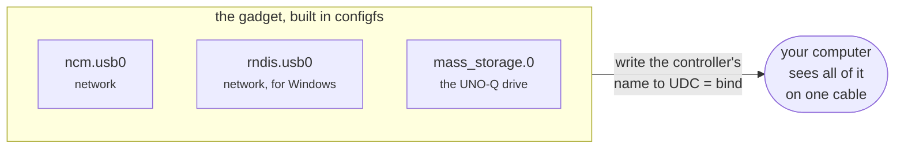

<!--
Copyright (c) 2026 Jim Wyatt
SPDX-License-Identifier: MIT
-->
# One cable, many devices

Plug the board into a computer and it becomes a **network adapter** and a **USB
drive**, over the same cable that is powering it. You are very likely reading
this page through exactly that.

This is the part of the board that most surprises people, so it is worth
understanding rather than just using.

## Host and device

Every USB connection has two ends with different jobs.

The **host** is in charge. It supplies power, asks what is connected, assigns
addresses, and starts every transfer. Your laptop is a host. USB devices never
speak unless spoken to.

The **device** (or peripheral) answers. A mouse, a webcam, a memory stick.

Most chips can only be one or the other. This board's USB-C port can be
**either** — and that is why plugging it into a computer changes what the board
*is*, not just what it is connected to.

> **The trap.** The port cannot be both at once. While the board is a device to
> your laptop, it is not a host — a hub, a keyboard or a USB stick plugged into
> it is simply gone until you disconnect. There is one USB controller, and it has
> one job at a time. This is a hardware fact, not a setting.

Which role it takes is negotiated by the USB-C connector itself, from the
electrical signals on the cable. **You cannot switch it from software** — a real
disappointment if you have done this on a Raspberry Pi, where you can.

## Being a device on purpose: the gadget

Linux can pretend to be a USB device. The framework is called **USB gadget**, and
you configure it by *making directories*:

```bash
ls /sys/kernel/config/usb_gadget/unoq/
```

This is **configfs**: a filesystem where creating a directory creates an object
in the kernel. Making a directory called `functions/ncm.usb0` does not create a
folder — it creates a USB network function.

A gadget is assembled from:

- **Functions** — the individual things it can be: a network adapter (`ncm`), a
  disk (`mass_storage`), a serial port (`acm`).
- **Configurations** — sets of functions offered together. A host picks one.
- **A UDC** — the actual USB controller. Writing its name into the gadget's `UDC`
  file is the moment the board appears on the host. This is called **binding**.



Ours offers a network adapter *and* a drive in one configuration, which is why a
single cable gives you both.

**Try it:**

```bash
~/hybrid/usb/status.sh
```

That prints the whole picture: the role, the controller, both configurations and
their functions, the bridge, the addresses, and the recent log.

## Why the address is unusual

Two computers connected by a cable both need IP addresses, and something has to
hand them out.

Normally the board runs a DHCP server and gives your laptop an address on
`10.55.0.0/24` — a deliberately obscure range, because a board handing out
`192.168.0.x` on a cable would collide with the network the laptop is already on
and break its real connection.

But if you turn on **internet sharing** on your computer — so the board can reach
the internet through it — Windows and macOS stop negotiating. Windows pins its
end to `192.168.137.1` and runs *its own* DHCP server. It will never accept an
address from us.

So the board has two modes, and the setting lives in `/etc/default/unoq-usb`:

| Mode | Board | Right when |
|---|---|---|
| `server` | is `10.55.0.1`, hands the computer an address | the computer is just something you reach the board from |
| `client` | asks the computer for an address | the computer is sharing its internet with the board |

If both ends try to be the server, you get two computers on one wire with
addresses on different networks, unable to see each other — which looks exactly
like a dead cable, with nothing logged anywhere.

## The cable is also the power

Here is where this gets genuinely tricky, and it explains several defensive
things in this project.

As a device, the board is powered *by* the host. A laptop port with no power
negotiation supplies quite a modest amount — not much for four CPU cores plus a
microcontroller.

Two consequences:

**Every cable change is also a power cut.** You cannot watch the board being
plugged in, because it is rebooting as you do it. No session survives it. That
is why `status.sh` exists: whatever went wrong has always already finished by the
time you can look, so the post-mortem needs to be one command.

**Binding can brown out the board.** Binding re-enumerates the port, which can
draw enough current to drop the voltage and reset the board. Then it boots, the
cable is still there, it binds again, and it browns out again — a loop with no
window in which to log in and stop it.

This project handles that with a **bind guard**: it counts boots that never
proved themselves healthy, and after three it refuses to bind. The board gives
up the gadget and keeps the network, which is the right way round — the gadget is
the thing being experimented with, the network is how you get in to fix it. If
wifi has been turned off, the guard turns it back on.

That is the same pattern as firmware rollback from the previous page: **try the
new thing, fall back automatically if it does not confirm itself.**

**Try it — see the guard's state:**

```bash
~/hybrid/usb/bind-guard.sh status
journalctl -b -u unoq-usb-bind -t unoq-bind-guard
```

## The drive

The board also offers a read-only disk — the one this documentation is on.

It is a single file, `~/unoq-share.img`, containing a partition table and a FAT32
filesystem. The gadget exports that file as a disk; the board mounts the same
file read-only to serve it over HTTP. **One copy, two ways out**, so the drive
and the web page cannot disagree about what is on the board.

Two details that took experimentation to get right:

- **It has a partition table.** Formatting the image directly works fine on
  Linux and Windows will often refuse to assign it a drive letter. A real USB
  stick has an MBR; so does this.
- **It is exported read-only.** If the host could write while the board has the
  filesystem mounted, both would be caching the same blocks with neither aware of
  the other, and FAT does not survive that for long.

> [!TIP]
> **Go deeper.** [usb.md](../reference/usb.md) has all of it: why NCM rather than RNDIS on
> Windows 11, why the route metric is 700, why there are two systemd units, and
> the full troubleshooting list.

## Check yourself

1. You plug a USB keyboard into the board's port while it is connected to your
   laptop. What happens, and why?
2. Your laptop has internet sharing on and the board cannot be reached at all.
   What is the most likely cause?
3. Why does the bind guard give up the *gadget* rather than retrying it?

Next: four LEDs, and the surprisingly hard question of what an indicator should
actually say.
