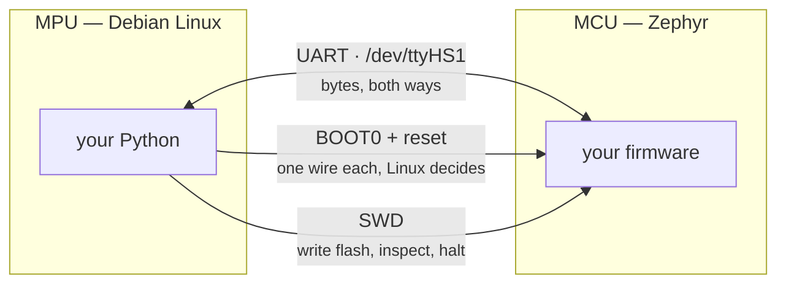

<!--
Copyright (c) 2026 Jim Wyatt
SPDX-License-Identifier: MIT
-->
# Two computers on one board

The single most important idea in this course is that your board is **two
computers that happen to share a piece of plastic**.

They do not share memory. They do not share an operating system. Neither can
read the other's variables. If they want to cooperate, they have to send each
other messages over a wire, exactly like two machines on a network — and the
wire is about two centimetres long.

## MPU and MCU

**MPU** means *microprocessor unit*. It is the kind of chip in your laptop or
your phone: fast, multi-core, with lots of memory, and it expects to run a full
operating system that manages files, users, processes and networks.

**MCU** means *microcontroller unit*. It is a whole computer on one chip —
processor, memory and the pins that connect to the outside world, all in a
single package. It is slower and has far less memory, and often runs no
operating system at all: just your program, alone, forever.

The comparison that matters is not "big versus small". It is **what each one is
bad at**.

### What the big one is bad at

Your Linux side has four cores at 2 GHz and gigabytes of memory. It can do
enormous amounts of work. What it cannot reliably do is anything at an *exact*
moment.

Linux is a **time-sharing** system. Dozens of processes want the CPU, and the
kernel decides who runs and for how long. Your program does not run
continuously; it is interrupted constantly, and it does not get to say no.

Suppose you ask Linux to flip a pin every 100 microseconds. Most of the time it
will. Occasionally the kernel handles a network interrupt, or writes to storage,
or another process wakes up, and your flip happens 2 milliseconds late — twenty
times later than intended. Your program has no bug. The system simply had
something else to do.

For a web server, being 2 ms late is invisible. For something driving hardware
that must be refreshed on a strict schedule, it is a visible flicker or a
failure.

### What the small one is bad at

The MCU has 786 KB of memory. Not gigabytes — kilobytes. There is no filesystem
unless you build one, no processes, often no network, and no operating system in
the sense you are used to.

But when your program says "wait 100 microseconds, then set this pin", it waits
100 microseconds and sets the pin. Every time. Nothing else is running, because
nothing else exists. That property is called being **deterministic** — the same
input produces not just the same output but the same *timing*.

A microcontroller cannot serve a website, resize an image, or run Python. It can
promise you exact timing, and the big chip cannot.

### So the board has both

| Job | Belongs on | Because |
|---|---|---|
| Reading `/proc/stat` for CPU load | MPU | It is a file on a Linux filesystem |
| Serving this web page | MPU | Networking, TCP, sockets, files |
| Refreshing 104 LEDs hundreds of times a second | MCU | Miss the timing and you see flicker |
| Reading a sensor every millisecond, exactly | MCU | Determinism is the entire requirement |
| Deciding what the LEDs should show | MPU | It is arithmetic on data Linux already has |

That last pair is the interesting one, and it is exactly what this project does.
Deciding *what* to draw is a data problem — it belongs on Linux. Making the
light actually appear is a timing problem — it belongs on the microcontroller.
The two halves meet in the middle, and the message that crosses between them is
tiny: a handful of bytes saying "the bars are this tall".

**This is the design skill the whole course is teaching.** Not how to use these
two specific chips, but how to look at a problem and see which half belongs
where.

## Try it: meet both computers

You are almost certainly typing into the MPU right now. Ask it what it is:

```bash
uname -a
nproc
free -h
```

Four cores, gigabytes of RAM, a Linux kernel. Nothing surprising for a computer.

Now ask the *other* one. This talks over a wire to the microcontroller and asks
it how it is doing:

```bash
cd ~/two-computers-one-board
./.venv/bin/python -c "
from unoq import MCU
with MCU() as mcu:
    print(mcu.status())
"
```

```
{'uptime_ms': 20438, 'flip': 0, 'sweeps': 29627}
```

Three numbers, from a computer with no screen, no operating system as you know
it, and no way to print to your terminal except by sending bytes down a wire.

- `uptime_ms` — milliseconds since the microcontroller last started. **Notice it
  does not match the Linux uptime.** They boot separately and reset separately.
  Two computers.
- `sweeps` — how many times it has scanned the whole LED grid. That number climbs
  by thousands per second, which is the determinism from earlier, counted.

## The one thing that surprises everyone

The two chips do not share memory. It is worth being blunt about the
consequences, because it catches every newcomer:

- A variable on the MCU **cannot** be read from Linux. There is no address for
  it. There is no pointer you can pass.
- Sending a message means **serialising** it: turning a value into bytes,
  pushing those bytes down a wire, and having the other side turn them back.
- Messages take time and can fail. A wire can be disconnected; a chip can be
  held in reset; bytes can be lost.

If you have used threads, this is *not* that. Threads share memory. This is much
closer to two servers talking over a network — and thinking of it that way will
serve you well every time you are confused about why the other side "cannot see"
something.

## How they are actually wired



Three connections matter, and you will meet all of them:

1. **A serial line (UART)** — a pair of wires carrying bytes, one bit at a time.
   This is the conversation. On Linux it appears as a file: `/dev/ttyHS1`.
2. **A reset/boot control line** — a single wire Linux can pull high or low to
   decide *how* the microcontroller starts. Get this wrong and the chip runs the
   wrong program, or none.
3. **A programming interface (SWD)** — separate wires used to write new software
   into the chip's flash memory and to inspect it while it runs.

> [!TIP]
> **Go deeper.** Two of those control lines are on GPIO pins that are documented
> nowhere except [hardware.md](../reference/hardware.md) — working them out took real effort,
> and getting them wrong makes the board look dead. That page is the record.

## Check yourself

Before moving on, you should be able to answer these:

1. Why can't Linux drive the LED matrix directly, given it is vastly more
   powerful than the microcontroller?
2. Your program on Linux sets `x = 5`. What does the microcontroller see?
3. Which chip should decode a JPEG? Which should generate a precise 40 kHz pulse
   train? Why?

If the second one made you pause — the answer is *nothing at all* — then you
have the main idea.

Next: what is actually running on the Linux side, and why it looks so ordinary.
