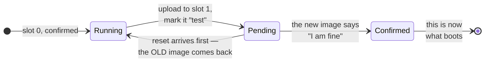

<!--
Copyright (c) 2026 Jim Wyatt
SPDX-License-Identifier: MIT
-->
# Updating safely

Flashing over SWD works, but it needs physical access to the debug wires. Real
devices are not on your desk. They are in a wall, in a field, in a customer's
building — and you still have to update them.

That is **FOTA**: firmware over the air, or in our case over a wire, but the
principle is the same. It introduces a problem that does not exist when you have
a debugger attached.

## The problem

You send new firmware. The device writes it and reboots into it. The new
firmware has a bug that crashes on startup, or breaks the very serial link you
sent it over.

**You are now finished.** The device cannot boot far enough to be told anything.
Nobody can send it a fix, because receiving is exactly what is broken. Your only
option is to physically visit it.

This failure mode is called **bricking**, and it is why firmware updates are
built differently from software updates.

## The answer: two copies, and a probation period

Two ideas together solve it.

**Keep two copies of the firmware.** The chip's flash is divided into *slots*.
Slot 0 holds what is running; slot 1 holds the incoming update. The running
firmware is never overwritten by the download — if the transfer fails halfway,
nothing has been lost.

**Make the new one prove itself.** When a new image first boots, it is marked
*pending*, not *good*. If it runs well enough to say "I am fine", it is
**confirmed** and becomes permanent. If it crashes, or hangs, or simply never
gets around to confirming, the next reset **puts the old one back automatically**.

The small program that manages all this is a **bootloader**. It runs before your
application, decides which slot to boot, performs swaps, and enforces probation.
Ours is **MCUboot**, and this is why the previous page had you flash the
bootloader and the application together.



The arrow that matters is the one going backwards. Nothing has to *detect* a bad
update; an update that fails to confirm is simply undone by the next reset,
including the reset caused by the thing crashing.

## What a bootloader does, in order

1. The chip powers on and starts executing at a fixed address. **That is the
   bootloader**, not your program.
2. It looks at the slots and their flags: is there an update staged? Is the
   running image confirmed?
3. If an update is pending, it swaps the slots.
4. It checks the signature of what it is about to run.
5. It jumps into your application.

That signature check is why builds produce `zephyr.signed.hex`. `zbuild` signs
automatically. **Unsigned images are refused** — the bootloader will not run
code it cannot verify, which is a security property and also stops you shipping
a corrupted transfer.

## Try it: the whole cycle

The board keeps its slot table where you can read it.

```bash
sudo systemctl stop unoq-cpu-bars
cd ~/hybrid
./.venv/bin/python -c "
from unoq import fota
for s in fota.images():
    print(f\"slot {s['slot']}  {s['version']}  active={s['active']}  confirmed={s['confirmed']}\")
"
```

```
slot 0  0.0.0.1786235698  active=True  confirmed=True
```

One image, running, confirmed. Now build a new one and stage it:

```bash
zbuild mcu/app                    # a fresh build gets a new version stamp
./.venv/bin/python -c "
from unoq import fota
fota.upload('/home/arduino/zephyrproject/build/zephyr/zephyr.signed.bin')
"
```

You will see it upload in chunks. Look at the slots again and there are two:
slot 0 running, slot 1 staged.

Now the interesting part — mark it pending and reboot into it:

```bash
./.venv/bin/python -c "
from unoq import fota
import time
fota.test()      # mark the staged image pending
fota.reset()     # reboot; MCUboot swaps the slots
time.sleep(12)
for s in fota.images():
    print(f\"slot {s['slot']}  {s['version']}  active={s['active']}  confirmed={s['confirmed']}\")
"
```

```
slot 0  0.0.0.1786239012  active=True   confirmed=False
slot 1  0.0.0.1786235698  active=False  confirmed=True
```

**Read that carefully.** The new image is running, and `confirmed=False`. It is
on probation. The old image is still there, intact, in the other slot.

### Watch it undo itself

Reset again *without* confirming, and MCUboot reverts:

```bash
./.venv/bin/python -c "
from unoq import fota
import time
fota.reset(); time.sleep(14)
for s in fota.images():
    print(f\"slot {s['slot']}  {s['version']}  active={s['active']}  confirmed={s['confirmed']}\")
"
```

```
slot 0  0.0.0.1786235698  active=True   confirmed=True
slot 1  0.0.0.1786239012  active=False  confirmed=False
```

The old firmware is back, and you did nothing but reboot. **That is the safety
net.** A firmware that cannot survive its first boot cannot keep the board.

### Or keep it

To make an update permanent, confirm it while it is running:

```bash
./.venv/bin/python -c "
from unoq import fota
import time
staged = [s for s in fota.images() if not s['active']][0]
fota.test(staged['hash']); fota.reset(); time.sleep(14)
fota.confirm()                     # 'I am fine, keep me'
print('confirmed')
"
sudo systemctl start unoq-cpu-bars
```

Now a reset leaves it in place. The probation has been passed.

## Who confirms, and when

`fota.confirm()` here is called by a human, which is fine for learning and wrong
for a real product. In a deployed device *the firmware confirms itself* — after
it has checked the things that matter: the radio associated, the sensor
answered, the watchdog is being fed.

The rule of thumb: **confirm only after the device has proved it can do the job
you would have to visit it to restore.** Confirming in the first line of `main`
technically works and protects you from nothing, because a program that crashes
in `main` line two has already confirmed itself.

This is the same shape as the guard described in
[usb.md](../reference/usb.md) for the USB gadget: try the new thing, and fall back
automatically if it does not confirm itself. Once you have seen the pattern, it
turns up everywhere something can strand you.

## What it does not protect against

Be clear about the limits:

- **A bad bootloader.** MCUboot itself is not updated this way. Corrupt it and
  SWD is your only way back.
- **Firmware that confirms itself and then fails.** Probation ends the moment you
  confirm; what happens after is your problem.
- **Hardware faults.** Nothing here helps if the flash chip is failing.

SWD remains the recovery path of last resort, which is why this board's design
keeps those wires available even though you rarely need them.

> [!TIP]
> **Go deeper** — [MCUboot's own documentation](https://docs.mcuboot.com/) is
> the source for slots, swap and the confirm flag; this page is a
> simplification of its "Design" chapter. The wire protocol underneath is
> [Zephyr's SMP](https://docs.zephyrproject.org/latest/services/device_mgmt/smp_protocol.html).
> [Interrupt](https://interrupt.memfault.com/blog/) has the best free writing
> anywhere on firmware update strategies that survive contact with real
> devices.

## Check yourself

1. Why keep two slots rather than writing the new image over the old one and
   saving half the flash?
2. A device boots a new image, confirms in the first line of `main`, then crashes
   ten seconds later on every boot. What does the rollback do for you?
3. You have a device in a wall. Which of these can you recover from remotely: a
   broken application, or a broken bootloader?

Next: how one USB cable becomes a network, a disk, and a power supply at once.
