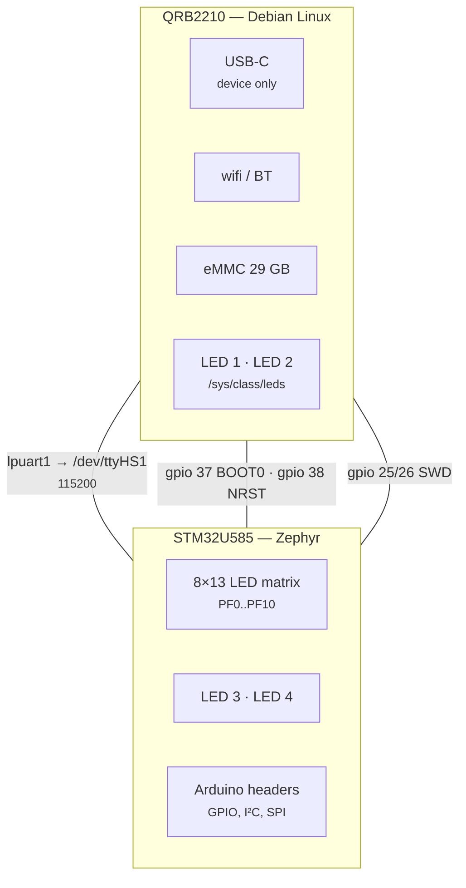

# The hardware, honestly

The UNO Q is two computers sharing a board.

| | **MPU** (Linux side) | **MCU** (real-time side) |
|---|---|---|
| Part | Qualcomm QRB2210 (`arduino,imola`) | STM32U585 Cortex-M33 |
| Runs | Debian, Python, your services | Zephyr firmware |
| Memory | 3.6 GiB shared | 2 MB flash / 768 KB RAM |
| Reached via | native Linux syscalls | SWD, or a serial link |

Most Arduino-header GPIO is wired to the **MCU**, not the MPU. The MPU has its
own separate GPIO / I²C / SPI — that is what [`unoq`](mpu.md) talks to.



Every line between the two boxes is one this project drives, and getting any of
them wrong makes a working board look broken. They are the subject of the next
section.

---

## The two GPIOs nobody documents

**Read this before debugging anything.** `arduino-router` used to drive two MPU
GPIO lines the MCU depends on. That service is now disabled, so these must be
set by us — and when they are wrong, a perfectly good board looks broken.

| `gpiochip1` line | Function | Symptom when wrong |
|---|---|---|
| **37** | MCU **BOOT0**, latched at reset | Firmware flashes *and verifies*, but never runs. PC sits around `0x0bf9xxxx` — the STM32 ROM bootloader. |
| **70** | **UART link enable** | MCU transmits fine (`LPUART1 CR1=0x2d`, TC/TXE set) but `/dev/ttyHS1` reads zero bytes. |
| 25 / 26 / 38 | SWD swdio / swclk / srst | — |

```bash
~/two-computers-one-board/mcu/link-up.sh      # BOOT0=0, link-enable=1
```

### They are documented, in the bootloader

"Nobody documents" was true of everything Arduino publishes and false of what
Arduino ships. U-Boot lives in the `boot_a` / `boot_b` partitions, and its
embedded devicetree names all five lines and sets their power-on state:

```bash
sudo dd if=/dev/disk/by-partlabel/boot_a bs=1M count=16 2>/dev/null \
  | strings -n 4 | grep -A2 -E '^mcu-.*-state$'
```

| Name in U-Boot's devicetree | GPIO | What this project calls it |
|---|---|---|
| `mcu-swdio-state` | 25 | SWD swdio |
| `mcu-swclk-state` | 26 | SWD swclk |
| `mcu-boot0-state` | 37 | BOOT0 |
| `mcu-nrst-state` | 38 | SWD srst |
| `mcu-spi-rdy-state` | 70 | UART link enable |

Two things follow. The states these lines are in before Linux starts are set by
U-Boot, not by anything on the rootfs — which is why they are sane at boot even
with `arduino-router` disabled.

And the last row disagrees with itself. Line 70 is empirically what makes
`/dev/ttyHS1` produce bytes, which is why this project calls it a UART enable.
U-Boot calls it an **SPI ready** line. Both descriptions can be true of one pin,
but it is evidence that the two chips were wired for a faster channel than a
115200 serial line, and nothing here uses it. Unresolved — see the open issues.

`flash.sh` calls this automatically, and `unoq.MCU` calls it on construction.
`unoq-link.service` applies it at boot.

Pin state **persists after the `gpioset` process exits** — the SoC pinctrl keeps
driving the last value — which is why a one-shot is enough and no daemon is
needed. BOOT0 is only sampled at MCU reset, so set it *before* resetting.

> ### Never `gpioget` these two lines
>
> `gpioget` **requests the line as an input**, and that drops the drive the same
> way a reboot without `unoq-link.service` would. Reading the pins is enough to
> break the link — you get plausible-looking values back (`37=active`,
> `70=inactive`, i.e. exactly the broken state) and the MCU goes quiet.
>
> Check them without touching them. `gpioinfo` only reads line *info*, never
> requests the line:
>
> ```bash
> gpioinfo -c gpiochip1 37 70      # both must say `output`
> hpy -c "from unoq.link import link_state; print(link_state())"
> ```
>
> `output` means driven. `input` means floating — run `link-up.sh`. This is why
> `unoq.link.link_state()` reports *direction* rather than value: there is no way
> to read the value that does not also destroy it.

> `mcu/link-up.sh` is referenced by `/etc/systemd/system/unoq-link.service`.
> **Do not move or rename it** without reinstalling that unit.

---

## The two UARTs

They are **not** interchangeable.

| Node | Pins | Goes to |
|---|---|---|
| `lpuart1` | PG7/PG8 + RTS/CTS on PG6/PG5 | **the Linux MPU** → `/dev/ttyHS1` |
| `usart1` | PB6/PB7 | the Arduino header pins (D0/D1) |

Upstream Zephyr's `arduino_uno_q` board defaults `zephyr,console` to **`usart1`**,
so a stock `hello_world` prints to the *header pins* and you see nothing from
Linux. Override it in a board overlay — see
[`mcu/app/boards/arduino_uno_q.overlay`](../../mcu/app/boards/arduino_uno_q.overlay).

The RTS/CTS pair on `lpuart1` is the giveaway: hardware flow control means a
board-to-board link.

---

## The LED matrix

104 blue LEDs in an 8×13 grid, wired to the **MCU** on **PF0–PF10** and
charlieplexed: each LED is one *ordered* pair of those eleven pins, lit by
driving one high, one low, and leaving the other nine as inputs. Eleven pins
give 110 ordered pairs; the panel uses the first 104, in that order.

Upstream Zephyr's `arduino_uno_q` board **does not mention the matrix at all**,
and neither does the datasheet. The wiring is recorded in exactly one place —
Arduino's own core (`ArduinoCore-zephyr`, `loader/matrix.inc`) — which is where
this project's pin map and 10 µs refresh slot come from. Nothing else from that
core is used; the driver is
[`mcu/app/src/matrix.c`](../../mcu/app/src/matrix.c) and the devicetree nodes it
needs (`gpiof`, `timers17`) are declared in the app's board overlay.

PF11–PF15 are *not* part of the panel — PF14/PF15 reach the Arduino header — so
the driver masks only the low eleven pins when it tri-states the port.

See [mpu.md](mpu.md#cpu-bars-on-the-led-matrix) for the display built on this.

## The four RGB LEDs

Separate from the 8x13 matrix, and split across both processors. This trips
people up, because only half of them are visible from Linux.

| | Driven by | Named |
|---|---|---|
| **LED 1** | Linux | `unoq:user-red1` / `-green1` / `-blue1` |
| **LED 2** | Linux | `unoq:panic-red2` / `unoq:wlan-green2` / `unoq:bt-blue2` |
| **LED 3** | **STM32** | `led3_red` / `led3_green` / `led3_blue` |
| **LED 4** | **STM32** | `led4_red` / `led4_green` / `led4_blue` |

They sit above the matrix, opposite the USB-C port.

### Six sysfs entries are two LEDs

`/sys/class/leds/unoq:*` lists six writable channels, and it is very natural to
read that as six indicators. It is not: they are the red, green and blue
channels of two RGB packages, and the `-1` / `-2` suffixes are the only hint.

**sysfs cannot tell you this.** Every channel gets its own directory and its own
`brightness` file whether it is one package or six, and they all hang off the
same `gpio-leds` platform node. Lighting four channels to mean four separate
things produces two cyan LEDs, which is how this was discovered.

### `mmc0::` is not one of them

There is a seventh entry, `mmc0::`, and it is a different animal:

```
unoq:user-red1  ->  platform/leds/leds/...            (gpio-leds)
mmc0::          ->  platform/soc@0/4744000.mmc/leds/  (the MMC controller)
```

The MMC subsystem registers it so a board *can* wire an activity light to it.
Nothing is wired to it here. It has `max_brightness 255` where the real ones
have 1, and it will never light.

### The disk-activity triggers do not fire

`mmc0`, `disk-activity` and `disk-write` are all offered in every LED's trigger
list, and all of them accept being selected. **None of them do anything.**
Measured with 400 MB of `O_DIRECT` writes in flight, sampling brightness 400
times: on in **zero** samples, for all three.

Being listed is not being implemented. If you want disk activity on a LED here,
you must sample `/sys/block/mmcblk0/stat` yourself - that counter does move.

### What this project shows on them

`status/leds.sh` (Linux) and `mcu/app/src/status_leds.c` (firmware):

| | LED 1 | LED 2 | LED 3 | LED 4 |
|---|---|---|---|---|
| green | internet reachable | all units healthy | image **confirmed** | MPU spoke recently |
| yellow | — | — | image **unconfirmed**, reverts on reset | — |
| blue | cable, but no route beyond | — | — | — |
| red | no uplink at all | unit failed / bind guard tripped | subsystem failed | MPU silent >4s |

LED 4 is worth understanding: it shows the *absence* of traffic. A blink per
message would be a clock - `cpubars` sends twice a second, so it would blink
twice a second forever and mean nothing. The tick stopping is the news, and it
is news Linux cannot deliver, because a host that has stopped talking cannot
report that it stopped.

`~/two-computers-one-board/status/leds.sh explain` prints the current scheme; `... test` cycles the
colours so you can learn which physical LED is which.

## How the MPU flashes the MCU

There is no external debug probe. The MPU bit-bangs SWD on its own GPIO lines
using OpenOCD's `linuxgpiod` driver:

```
Info : Linux GPIOD JTAG/SWD bitbang driver (libgpiod v2)
Info : SWD DPIDR 0x0be12477
Info : [stm32u5.cpu] Cortex-M33 r0p4 processor detected
```

No root needed — your user is in the `gpiod` group.

> **`/opt/openocd` is owned by no Debian package.** `dpkg -S /opt/openocd` finds
> nothing; it was placed there by an install script, so apt will never reinstall
> it. Copy it somewhere safe (`cp -a /opt/openocd ~/uno-q-backup/`) before you
> purge anything, and note that it is reproducible from source — see
> [the README](../../README.md#rebuilding-openocd).

`apt install openocd` does **not** substitute: Debian ships 0.12.0 (2023), which
predates the libgpiod v2 support this board needs.

---

## Flash layout

```
0x08000000  boot_partition   64K   MCUboot (38K used)
0x08010000  slot0           416K   running signed app
0x08078000  slot1           416K   staged update
0x080e0000  storage         128K   NVS (settings, boot counter)
```

Two 416K slots out of 2 MB of flash, which is why
[the MCU is 96% empty](https://github.com/jim-wyatt/two-computers-one-board/issues/12) is
an open question rather than a boast — the part has two banks and this layout
uses one.

Images link at `0x08010000` and must be **signed** — MCUboot refuses a raw
image. See [mcu.md](mcu.md).
